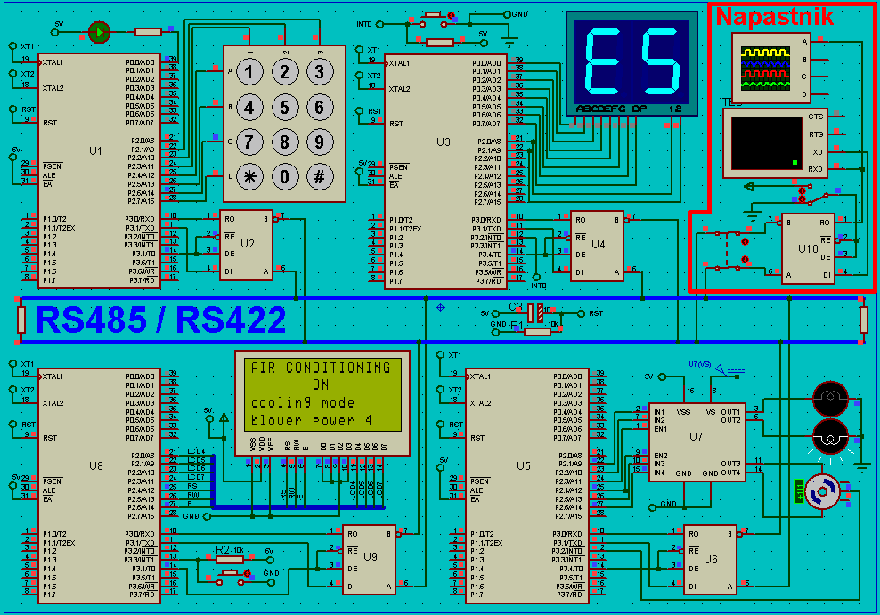

# Embedded Systems Project  
# CAR CONTROL PANEL

Project Description:  
The project simulates a car control panel that allows the user to control the radio, air conditioning, and traction control, as well as display the configured parameters.  
The project was developed in the Keil environment, is based on the AT89C52 microcontroller, and uses a schematic designed in the Proteus software.

## Device User Manual:

### Radio:
- **Power on** – press the button near the BCD display – the LED indicator will light up, and the current radio station will be displayed.
- **Power off** – press and hold the button near the BCD display for 2 seconds – the LED indicator will turn off and the display will turn off.
- **Radio station control:**
	- Previous station – button 1.
	- Next station – button 2.
- **Mute / unmute radio** – button 3 – during mute, the mute symbol will blink on the display.
- **Volume control** (scale 1–30, current volume will briefly appear on the BCD display):
	- Decrease volume – button 4.
	- Increase volume – button 5.

### Traction Control Settings:
- Traction control parameters are displayed on the LCD display.
- **Enable / disable traction control settings** – press buttons *, 0, # in sequence (the LED blinks twice) – when traction control settings are enabled, radio control via the keypad is disabled.
- **Select traction control mode:**
	- Normal (default mode) – press button 1.
	- Sport – press button 2.
	- Off – press button 3.

### Air Conditioning:
- **Power on / off** – press button 6 (while the air conditioning is on, the current airflow level and operating mode are displayed on the LCD screen; the motor direction changes every 20 rotations).
- **Change mode** – heating or cooling – press button 7 (lit the upper bulb in yellow-orange color means heating and the lower bulb in white means cooling).
- **Change airflow level (1–6):**
	- Decrease – press button 8.
	- Increase – press button 9.

### LCD Screen:
- The screen has 2 display modes – one for displaying air conditioning parameters and one for displaying traction control mode.
- **Switch display mode** – press and hold the button near the screen for one second.

### Image of schematic 👇

